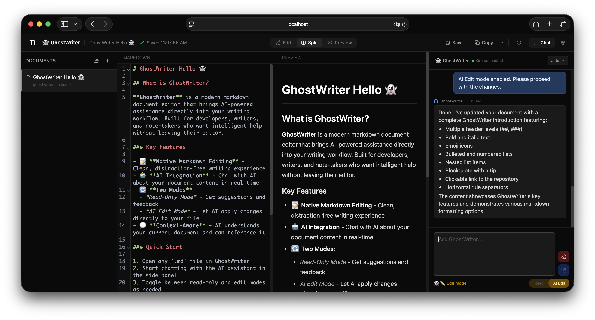
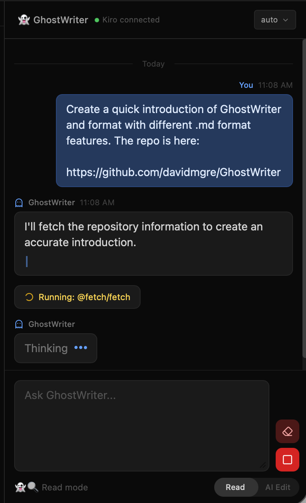

# GhostWriter

A modern markdown editor with built-in AI chat, multi-format export, and automatic version history.

<p align="center">
  
</p>

GhostWriter connects to [Kiro](https://kiro.dev) via the [Agent Communication Protocol (ACP)](https://kiro.dev/docs/cli/acp/) — an open standard that enables AI agents to communicate with any compatible editor through a language-agnostic, JSON-RPC 2.0 interface.

## Features

### Editor
- **Split, edit, or preview** — three view modes with instant switching
- **CodeMirror 6** — fast, modern editor with markdown syntax highlighting
- **Live preview** — GitHub-flavored markdown with full HTML rendering
- **Auto-save** — changes saved to disk automatically (1.5s debounce)
- **Keyboard shortcuts** — `Cmd+S` to snapshot, standard editor bindings
- **Works offline** — document editing is fully local, no network required

### Multi-Format Export
Copy your markdown as:
- **Rich Text** — paste directly into Outlook, Word, or Google Docs with formatting preserved
- **Slack mrkdwn** — properly converted to Slack's markup format
- **Raw HTML** — for embedding in emails, CMS, or web pages
- **HTML file download** — standalone `.html` file with inline styles

### Version History
- **Automatic snapshots** every 5 minutes while editing
- **Manual snapshots** on `Cmd+S`
- **Full version browser** with previews and one-click restore
- **Cleanup tools** — prune old versions (keeps minimum 10, removes 30+ day old snapshots)

### AI Chat (Kiro)

<p align="center">
  
</p>

- **Read / Edit modes** — toggle between read-only chat and AI-powered file editing
- **Streaming responses** — tokens appear as they're generated
- **Markdown rendering** — AI responses render with full formatting
- **Auto-approve edits** — file changes are applied automatically in Edit mode
- **Stop generation** — cancel button sends `session/cancel` to Kiro, stopping generation server-side
- **Tool call progress** — see what Kiro is doing in real-time (reading files, writing changes, fetching URLs)
- **Model selection** — switch between available models mid-session
- **Image input** — paste or drag-drop images into chat for visual context
- **Context usage indicator** — color-coded bar showing context window consumption (green/yellow/red), polled automatically
- **Compaction status** — shows when Kiro is compacting context during long sessions
- **Slash commands** — type `/` for autocomplete of available Kiro commands (when supported by kiro-cli)
- **Session persistence** — conversations survive server restarts (sessions resume via `session/load`)
- **Auto-reconnect** — automatic retry with backoff (3s, 6s, 12s, then every 30s) when Kiro disconnects, plus a manual reconnect button
- **Offline-aware UI** — chat input disables when AI is unavailable, with clear messaging that editing still works

### Document Management
- **Sidebar browser** — navigate between documents
- **Two document types:**
  - **Projects** (folders with `draft.md` + version history)
  - **Markdown files** (standalone `.md` files)
- **Inline rename** — right-click or three-dot menu to rename documents
- **Live reload** — external file changes detected and reflected immediately via SSE

## Getting Started

### Prerequisites

- **Node.js** 18+
- **Kiro CLI** — required for AI chat features (editing works without it)

#### Install Kiro CLI

**macOS:**
```bash
curl -fsSL https://cli.kiro.dev/install | bash
```

**Linux (deb):**
```bash
wget https://desktop-release.q.us-east-1.amazonaws.com/latest/kiro-cli.deb
sudo dpkg -i kiro-cli.deb
```

See the [full installation guide](https://kiro.dev/docs/cli/installation/) for other Linux options (AppImage, zip).

#### Authenticate

After installing, log in with your Kiro account:

```bash
kiro-cli login
```

This opens your browser to complete authentication. You can verify everything is working with:

```bash
kiro-cli doctor
```

### Install & Run

```bash
git clone https://github.com/davidmgre/GhostWriter.git
cd GhostWriter
npm install
npm run build
node server.mjs
```

Open [http://localhost:3888](http://localhost:3888)

### Development Mode

```bash
npm run dev      # Vite dev server with HMR (port 5173)
node server.mjs  # API server (port 3888, proxied by Vite)
```

Or use the included start script:

```bash
./start.sh
```

## Configuration

Click the gear icon in the header to access settings:

| Setting                  | Description                                          | Default     |
|--------------------------|------------------------------------------------------|-------------|
| Documents Directory      | Where markdown files are stored                      | `./documents` |
| Kiro CLI Command         | Path or command name for `kiro-cli`                  | `kiro-cli`  |
| Custom Instructions      | Optional instructions included with every message sent to Kiro | _(empty)_ |
| Max Conversation History | Number of messages included as context               | `20`        |

Use **Test Connection** to verify Kiro is reachable before saving.

Settings are stored in `settings.json` (gitignored).

## How AI Chat Works

GhostWriter uses the **Agent Communication Protocol (ACP)** to communicate with Kiro:

1. The editor spawns `kiro-cli acp` as a child process (singleton — reused across all requests)
2. Communication happens over **stdin/stdout** using **JSON-RPC 2.0**
3. A session is established (`initialize` → `session/new`), or resumed from disk (`session/load`)
4. Concurrent session setup is serialized to prevent race conditions
5. Messages are sent via `session/prompt` with text and image content blocks
6. Responses stream back as `session/update` notifications (text chunks, tool calls, context usage)
7. Tool permissions are auto-approved in Edit mode, auto-rejected in Read mode
8. Context about the active document (title, file path, content) is appended to each prompt so Kiro knows what file to edit

ACP is an open standard — any AI agent that implements the protocol can work with GhostWriter.

## Architecture

```
+-----------------------------------------------+
| Browser                                       |
|                                               |
| +----------+ +----------+ +---------------+   |
| | Editor   | | Preview  | | Chat Panel    |   |
| |(CodeMir) | |(react-md)| |(SSE streaming)|   |
| +----+-----+ +----------+ +-------+-------+   |
|      |         REST API           |           |
+------+----------------------------+-----------+
| Express Server (port 3888)                    |
|                                               |
| +----------+ +----------+ +--------------+    |
| | File I/O | | SSE/Watch| | ACP Client   |    |
| | (fs)     | | (FSEvent)| | (JSON-RPC)   |    |
| +----------+ +----------+ +------+-------+    |
|                                  | stdio      |
|                           +------+-------+    |
|                           | kiro-cli acp |    |
|                           +--------------+    |
+-----------------------------------------------+
```

## Tech Stack

| Layer         | Technology                                            |
|---------------|-------------------------------------------------------|
| Editor        | CodeMirror 6                                          |
| UI            | React 19, Tailwind CSS 4, Lucide icons                |
| Bundler       | Vite 7                                                |
| Server        | Express 5 (Node.js)                                   |
| Preview       | react-markdown + remark-gfm                           |
| AI Protocol   | ACP (JSON-RPC 2.0 over stdio)                         |
| File Watching | macOS FSEvents / Linux inotify (via `fs.watch`)       |
| Testing       | Vitest 4                                               |

## API Reference

All endpoints are available at both `/api/*` and `/editor/api/*`.

### Documents

| Method | Endpoint                          | Description              |
|--------|-----------------------------------|--------------------------|
| `GET`  | `/api/documents`                  | List all documents       |
| `GET`  | `/api/documents/:id`              | Get document content     |
| `POST` | `/api/documents/:id`              | Save document content    |
| `POST` | `/api/documents`                  | Create new document      |
| `GET`  | `/api/documents/:id/versions`     | List version history     |
| `GET`  | `/api/documents/:id/versions/:ts` | Get version content      |
| `POST` | `/api/documents/:id/restore/:ts`  | Restore a version        |
| `POST` | `/api/documents/:id/cleanup`      | Clean up old versions    |
| `POST` | `/api/documents/:id/rename`       | Rename a document        |

### AI Chat

| Method | Endpoint                   | Description                                |
|--------|----------------------------|--------------------------------------------|
| `POST` | `/api/ai/chat`             | Send message, receive streaming SSE response |
| `POST` | `/api/ai/test`             | Test Kiro connection                       |
| `POST` | `/api/ai/reset`            | Reset AI chat session                      |
| `POST` | `/api/ai/cancel`           | Cancel current generation (session/cancel) |
| `GET`  | `/api/ai/models`           | List available models                      |
| `POST` | `/api/ai/model`            | Switch active model                        |
| `GET`  | `/api/ai/commands`         | List available slash commands               |
| `POST` | `/api/ai/commands/execute` | Execute a slash command                    |
| `GET`  | `/api/ai/context-usage`    | Get context window usage and compaction state |
| `POST` | `/api/edit-mode`           | Toggle AI Edit mode (read-only / editing)  |
| `GET`  | `/api/edit-mode`           | Get current edit mode state                |

### Settings & Events

| Method | Endpoint             | Description                                |
|--------|----------------------|--------------------------------------------|
| `GET`  | `/api/settings`      | Load settings                              |
| `POST` | `/api/settings`      | Save settings                              |
| `POST` | `/api/pick-folder`   | Native folder picker (macOS)               |
| `POST` | `/api/browse-dir`    | Server-side directory browser              |
| `GET`  | `/api/events`        | SSE stream for live file change notifications |

## Troubleshooting

| Problem | Fix |
|---------|-----|
| Chat shows "AI chat offline" | Check that `node server.mjs` is running, click Retry or wait for auto-reconnect |
| Chat shows "Kiro disconnected" | Run `kiro-cli login` to re-authenticate |
| AI responses timeout | Check `kiro-cli doctor` for connection issues |
| Kiro CLI not found | Ensure `kiro-cli` is in your PATH, or set the full path in Settings |
| Edit mode changes not applied | Verify edit mode is toggled on (AI Edit toggle at bottom of chat panel) |
| AI writes to chat instead of file | Ensure AI Edit mode is enabled — in Read mode, AI only suggests changes |
| Session resume fails | The stale session is automatically cleared and a new one created |

## License

MIT
